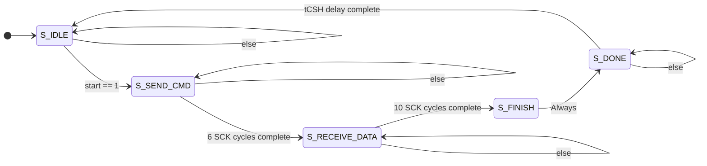

# Verilog SPI Master Controller for MCP3008 ADC

## Project Overview

This repository contains the Verilog source code and a complete verification environment for a synthesizable SPI (Serial Peripheral Interface) Master controller. The controller is specifically designed to interface with the Microchip MCP3008, an 8-channel, 10-bit Analog-to-Digital Converter (ADC).

The primary goal of this project was to design a robust, reusable, and protocol-compliant SPI Master from the ground up. The entire process, from datasheet interpretation to final verification, is documented here. This project demonstrates a deep understanding of digital design principles, industry-standard communication protocols, and modern verification methodologies.

**Key Features:**
*   **Protocol Compliant:** Implements SPI Mode 0 as required by the MCP3008.
*   **Parameterized:** Easily configurable to select any of the 8 ADC channels.
*   **Robust FSM Design:** A multi-state Finite State Machine manages the entire half-duplex communication sequence.
*   **High Code Coverage:** The accompanying testbench is designed to cover corner cases, including back-to-back transactions and mid-transaction resets.
*   **Self-Checking Verification:** The testbench includes a scoreboard and provides a definitive "PASS" or "FAIL" summary, enabling automated regression.

## System Design and Architecture

### Design Requirements

The controller was designed based on the official MCP3008 datasheet with the following parameters:
*   **System Clock:** 50 MHz
*   **SPI Clock:** ~3.125 MHz (generated via clock division)
*   **SPI Mode:** Mode 0 (CPOL=0, CPHA=0)
*   **Transaction Protocol:** A 6-cycle command/wait phase followed by a 10-cycle data receive phase.

### Module Block Diagram

```
                 +---------------------------+
                 |                           |
    clk          |                           |         MOSI
   ------------->|                           |------------------->
    rst          |                           |         SCK
   ------------->|                           |------------------->
    start        |       MCP3008_SPI         |         CS
   ------------->|       (Verilog)           |------------------->
    channel[2:0] |                           |
   ------------->|                           |         ADC_data[9:0]
                 |                           |<-------------------
    MISO         |                           |         data_valid
   <-------------|                           |<-------------------
                 |                           |
                 +---------------------------+
```

### Finite State Machine (FSM) Architecture

The controller's logic is managed by a 5-state FSM. This architecture ensures that the strict timing and protocol sequence of the MCP3008 are met.

*   `S_IDLE`: The default state, waiting for a `start` command.
*   `S_SEND_CMD`: Transmits the 5-bit command and waits for the ADC's internal sample time (6 SCK cycles total).
*   `S_RECEIVE_DATA`: Listens for the 10-bit result from the ADC (10 SCK cycles).
*   `S_FINISH`: Captures the final data and asserts the `data_valid` flag for one cycle.
*   `S_DONE`: Enforces a mandatory "cool-down" period (`tCSH`) to ensure the ADC is ready for a subsequent transaction.



## Verification Strategy

The design was verified using a comprehensive, self-checking testbench written in Verilog. The verification environment was designed to be as robust as the module itself.

**Key Components of the Testbench:**
1.  **DUT Instantiation:** The `MCP3008_SPI` module is instantiated as the Device Under Test.
2.  **Behavioral Slave Model:** A crucial block of code models the behavior of the MCP3008 slave. It is programmed to return a known 16-bit data stream (`16'hD550`) and accurately mimics SPI Mode 0 timing by changing its `MISO` output on the falling edge of `SCK`.
3.  **Comprehensive Test Sequence:** The test sequence is automated and self-checking. It performs a series of tests to achieve high code coverage:
    *   A "happy path" transaction on a specific channel.
    *   A back-to-back transaction on a different channel to test the FSM's ability to reset.
    *   A mid-transaction reset to test the robustness of the synchronous reset logic.
4.  **Scoreboard:** The testbench maintains an `error_count` register. At the end of the simulation, it checks this scoreboard to provide a definitive `--- ALL TESTS PASSED ---` or `--- TESTS FAILED ---` summary.

## Simulation Results

The design was simulated using the Xilinx Vivado Simulator. The waveforms below demonstrate a correct transaction for reading from Channel 2.

### Full Transaction Overview

The Full Waveform in Results shows the entire transaction, from the `start` pulse to the `data_valid` signal, with the final correct data (`150` hex) on the `ADC_data` bus.

### Detailed Command and Receive Phases

These zoomed-in waveforms namely Transimition and Receiving in Results show the bit-level accuracy of the `MOSI` command sequence and the subsequent `MISO` data reception, matching the datasheet's timing diagrams perfectly.

## How to Use

1.  **Synthesis:** The `MCP3008_SPI.v` module is written in synthesizable Verilog and can be included in any FPGA project.
2.  **Simulation:** The `tb_MCP3008_SPI.v` file can be used to simulate the module. Ensure both files are included in your simulation sources. The test suite will run automatically and report its pass/fail status in the Tcl console.

## Conclusion

This project successfully demonstrates a complete digital design and verification flow. The final SPI master is robust, protocol-compliant, and rigorously tested. The process highlighted the importance of careful datasheet interpretation and the power of a self-checking testbench in identifying subtle bugs and achieving a high degree of confidence in the final design.
